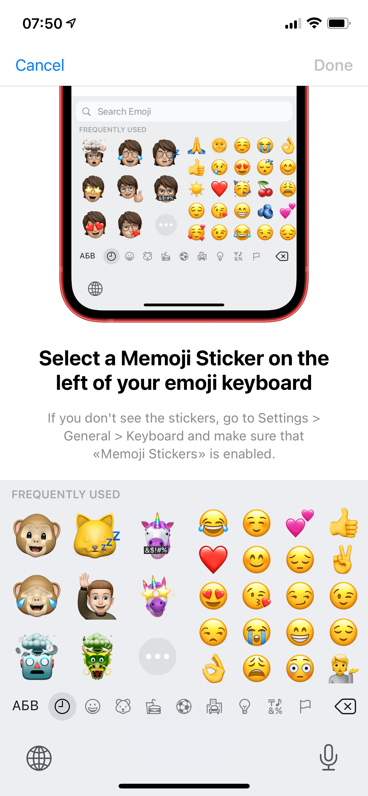
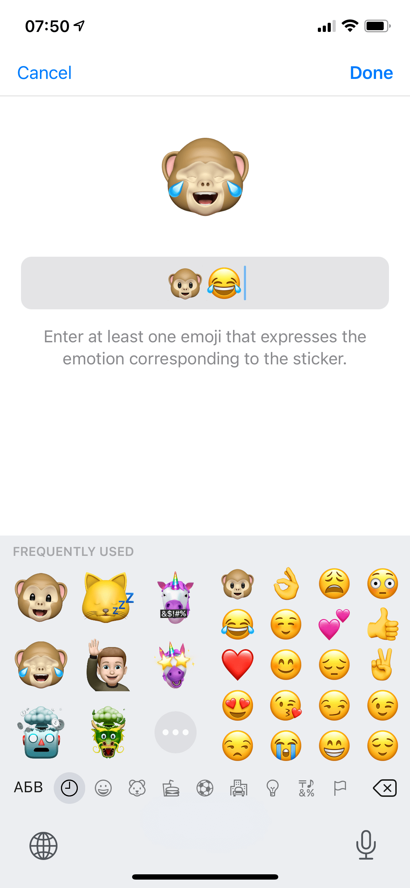
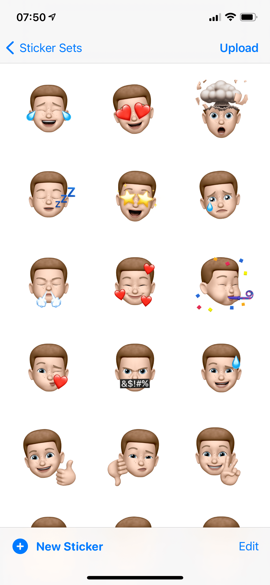
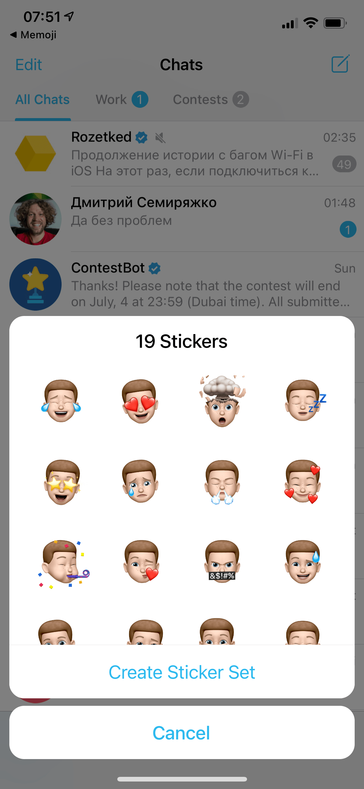

# Telegram-Memoji

In a [recent update](https://telegram.org/blog/animated-backgrounds), Telegram launched a platform for third-party apps that allow users to create and import their own stickers. They also announced a [competiotion](https://t.me/contest/262) for developers to create mobile apps that use the new import feature.

This repository contains my iOS app submitted for the contest. It allows users to combine their own [Memoji Stickers](https://support.apple.com/HT208986) into a sticker pack and then share it via Telegram.

## Screenshots

|  |  |  |  |
| ------------------------------------------------ | ----------------------------------------------- | ---------------------------------------------- | ---------------------------------------------- |
